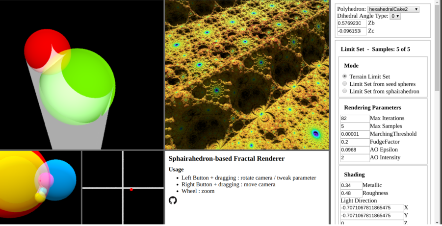

# Sphairahedron based Fractal Renderer



## Sphairahedron and fractals


Sphairahedron is geometrical concept invented by Kazushi Ahara and Yoshiaki Araki in 2003. A sphairahedron is a kind of polyhedron with spherical faces. We can make a tiling pattern of sphairahedra using inversion about their
spherical faces. Left image shows a cube-type sphairahedron, and right image shows the tiling pattern. In many case, it has a fractal structure.
This is a renderer for sphairahedron and its tilings.

For more details, see [sphairahedron.net](https://sphairahedron.net) or 
[Introductory Video](https://www.youtube.com/watch?v=vgrGWiYf-xU) of the software.

## Usage
We can move the parameter by dragging mouse left button. The parameter can be changed in control panel.
There is a control panel in right side.

## Build
```
npm install  
npm start  
# Access to localhost:3000  
```

## Author
- soma_arc (Kento Nakamura)

## Copyright
Copyright (c) 2017 - 2020 soma_arc (Kento Nakamura)
## License
Licensed under GPL-3.0
