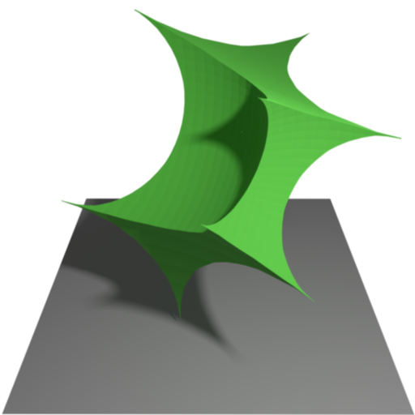
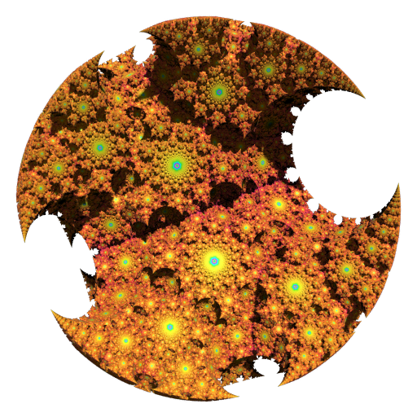

# Sphairahedron based Fractal Renderer

Sphairahedron is geometrical concept invented by Kazushi Ahara and Yoshiaki Araki in 2003. A sphairahedron is a kind of polyhedron with spherical faces. Left image shows a cube-type sphairahedron, and right image shows a quasi-sphere

For more details, see [sphairahedron.net](https://sphairahedron.net)

## Usage
We can move the parameter by dragging mouse left button. The parameter can be changed in control panel.
There is a control panel in right side.

## Author
- soma_arc (Kento Nakamura)

## Copyright
Copyright (c) 2017 - 2020 soma_arc (Kento Nakamura)
## License
Licensed under GPL-3.0